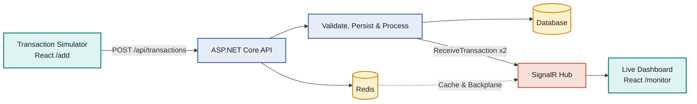

# Real-Time Financial Monitor

A real-time financial transaction monitor built with .NET 9, SignalR, React, TypeScript, PostgreSQL, SQLite, Redis, and Docker.

## Run with Docker Compose

1. Start Docker Desktop.
2. From the repository root, run:

```bash
docker compose up --build
```

3. Open the application:

```text
http://localhost:8081
```

Docker Compose starts the React frontend, .NET API, PostgreSQL, and Redis together.

## Overview

The system accepts transactions through an API, validates and processes them, stores the result, and updates a live dashboard through SignalR.



## Main Features

- `POST /api/transactions` for transaction ingestion.
- `GET /api/transactions` for the initial dashboard snapshot.
- `GET /health` for API and database readiness.
- SignalR over WebSocket for real-time updates.
- `Pending` to `Completed` or `Failed` processing flow.
- Status filtering and responsive dashboard updates.
- Simulator for exactly 100 concurrent transactions.
- Optional Redis Backplane and distributed cache.

## Frontend Routes

| Route | Purpose |
|---|---|
| `/add` | Create transactions and run the 100-transaction load test. |
| `/monitor` | View stored transactions and receive live SignalR updates. |

## Project Structure

```text
FinancialMonitor.Api/       .NET API, processing, persistence, caching, and SignalR
FinancialMonitor.Tests/     Unit and API integration tests
FinancialMonitor.Client/    React routes, dashboard, simulator, and SignalR client
docker-compose.yml          Local multi-service runtime
README.md                   Architecture and setup documentation
```

## Architecture

### Backend layers

- **Domain**: transaction entities and statuses.
- **Application**: validation and transaction processing.
- **Infrastructure**: EF Core persistence, caching, Redis, and the SignalR broadcaster.
- **Presentation**: HTTP controllers and SignalR Hub.

### Runtime modes

| Environment | Database | Cache | Realtime |
|---|---|---|---|
| Local development | SQLite | In-memory | SignalR |
| Docker multi-service runtime | PostgreSQL | Redis | SignalR + Redis Backplane |
| Future multi-pod deployment | PostgreSQL | Redis | SignalR + Redis Backplane |

The application uses explicit configuration for each runtime mode:

- **Local development / one API instance:** SQLite is the persistent database and in-process memory is used as the cache.
- **Docker Compose:** PostgreSQL is the shared source of truth, while Redis is used as a shared cache and SignalR Backplane.
- **Future multi-pod deployment:** the same architecture is ready for multiple API instances; Redis acts as the shared cache and SignalR Backplane between replicas.

## Transaction Processing
For demonstration purposes, incoming transactions follow a deterministic rule set:
Every new transaction starts as `Pending`.

- Amount up to `10,000`: `Completed`.
- Amount above `10,000`: `Failed`.

The dashboard receives the lifecycle updates and replaces the existing row by `transactionId`.

## Run Locally

### Backend

From the repository root:

```bash
dotnet test FinancialMonitor.sln
dotnet run --project FinancialMonitor.Api
```

### Frontend

In a second terminal:

```bash
cd FinancialMonitor.Client
npm install
npm run dev
```

Open:

```text
http://localhost:5173
```

## Testing

The solution includes unit tests and integration tests for validation, optimistic-concurrency-safe persistence, concurrent ingestion, caching, HTTP workflows, and SignalR broadcasting.

Run all backend tests:

```bash
dotnet test FinancialMonitor.sln
```

Validate the frontend:

```bash
cd FinancialMonitor.Client
npm run build
npm run lint
```

## Key Challenges Solved

- Safe concurrent ingestion and storage.
- Optimistic concurrency control on transaction updates.
- Real-time lifecycle updates with SignalR.
- A single application-level SignalR connection across route navigation.
- Version-guarded cache writes.
- Shared database and SignalR synchronization for multiple replicas.
- Responsive rendering during bursts of 100 transactions.

## Future Improvements

- Browser-level E2E tests covering the complete workflow across the frontend, API, database, cache, and SignalR.
- EF Core migrations instead of `EnsureCreated` for production schema management.
- A shared message queue (e.g. Redis Streams), if a future processing step becomes genuinely asynchronous or slow and needs to survive a pod restart.
- Kubernetes deployment with multiple API pods, ingress, secrets, and production-grade persistent storage.
- Additional deployment hardening for multi-node environments.
